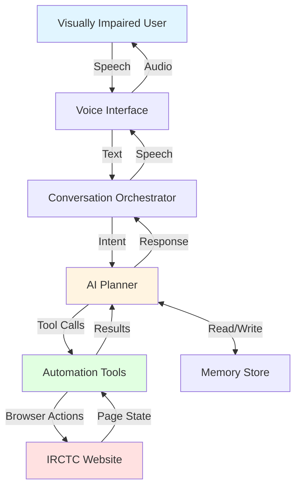
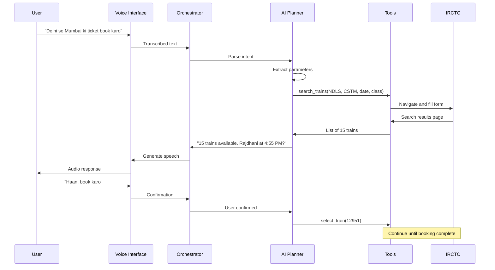
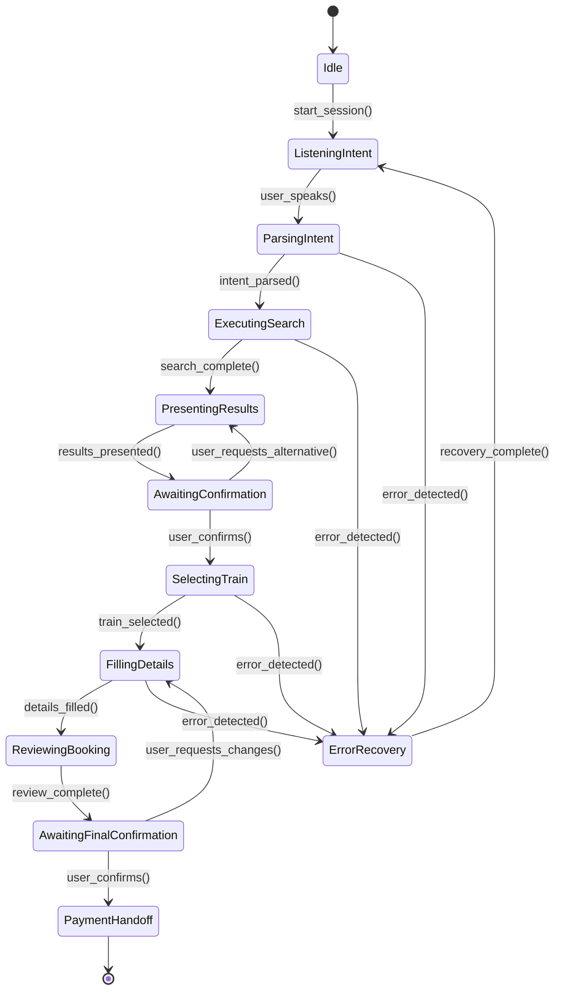

# Design Document: Drishti AI - IRCTC Voice Booking

## Overview

Drishti AI is a voice-driven web automation agent that enables visually impaired users to book train tickets on IRCTC through natural Hindi and English voice commands. The system employs a hybrid architecture where an LLM-based AI planner interprets user intent and orchestrates deterministic browser automation tools.

The design follows a clear separation of concerns:
- **Voice Interface Layer**: Handles speech-to-text and text-to-speech conversion
- **AI Planning Layer**: Parses intent, generates task plans, and makes decisions
- **Tool Execution Layer**: Executes browser automation actions on IRCTC
- **Memory Layer**: Stores user preferences securely
- **Orchestration Layer**: Coordinates the conversation loop between all components

This architecture ensures reliability (deterministic browser actions) while maintaining intelligence (LLM-based decision making).

## Architecture

### System Components



### Conversation Flow



## Components and Interfaces

### 1. Voice Interface

**Responsibilities:**
- Convert speech to text using Amazon Transcribe
- Convert text to speech using Amazon Polly
- Handle audio streaming and playback
- Support Hindi + English code-switching

**Interface:**

```python
class VoiceInterface:
    def listen() -> str:
        """
        Captures audio and returns transcribed text.
        Supports Hindi + English code-switching.
        Returns empty string if audio is unclear.
        """
        pass
    
    def speak(text: str) -> None:
        """
        Converts text to speech and plays audio.
        Uses Amazon Polly with Indian English voice.
        """
        pass
    
    def start_listening_session() -> None:
        """Starts continuous listening mode for a booking session."""
        pass
    
    def stop_listening_session() -> None:
        """Stops continuous listening mode."""
        pass
```

**Implementation Notes:**
- Use Amazon Transcribe with language code `hi-IN` for Hindi + English
- Use Amazon Polly with voice `Aditi` (Indian English female voice)
- Implement voice activity detection to know when user stops speaking
- Handle network errors gracefully with retry logic

### 2. AI Planner

**Responsibilities:**
- Parse user intent from transcribed text
- Extract booking parameters (stations, date, class)
- Generate structured task plans
- Decide next action based on page state
- Generate natural language responses
- Handle ambiguity and errors

**Interface:**

```python
class AIPlanner:
    def parse_intent(text: str) -> Intent:
        """
        Parses user utterance and extracts booking intent.
        Returns Intent object with extracted parameters.
        """
        pass
    
    def generate_task_plan(intent: Intent) -> List[ToolCall]:
        """
        Generates ordered list of tool calls to complete the booking.
        Returns list of ToolCall objects.
        """
        pass
    
    def decide_next_action(page_state: PageState, conversation_history: List[Message]) -> Action:
        """
        Decides next action based on current page state and conversation.
        Returns Action (tool call, question, or confirmation request).
        """
        pass
    
    def generate_response(tool_result: ToolResult) -> str:
        """
        Generates natural language response based on tool execution result.
        Returns text to be spoken to user.
        """
        pass
    
    def handle_error(error: AutomationError) -> str:
        """
        Analyzes error and generates recovery guidance.
        Returns text explaining the error and next steps.
        """
        pass
```

**Implementation Notes:**
- Use Amazon Bedrock with Claude 3 Sonnet model
- Implement structured output parsing for tool calls (JSON format)
- Maintain conversation history for context
- Use few-shot prompting with examples of Hindi + English code-switching
- Implement retry logic for LLM API failures

**Prompt Structure:**

```
You are Drishti AI, a voice assistant helping visually impaired users book train tickets on IRCTC.

Current conversation:
{conversation_history}

Current page state:
{page_state}

User said: "{user_input}"

Your task:
1. Understand what the user wants
2. Decide the next action (tool call, question, or confirmation)
3. Respond in natural Hindi + English

Available tools:
- search_trains(from_station, to_station, date, class)
- select_train(train_number)
- fill_passenger_details(name, age, gender, berth_pref)
- review_booking()
- get_page_state()

Respond in JSON format:
{
  "action_type": "tool_call" | "question" | "confirmation",
  "tool_name": "...",
  "tool_params": {...},
  "response_text": "..."
}
```

### 3. Automation Tools

**Responsibilities:**
- Execute browser actions on IRCTC using Playwright
- Extract page state and data
- Handle dynamic elements (autocomplete, date pickers)
- Detect errors and timeouts
- Implement selector fallback chains

**Interface:**

```python
class AutomationTools:
    def search_trains(from_station: str, to_station: str, date: str, travel_class: str) -> ToolResult:
        """
        Navigates to IRCTC, fills search form, and submits.
        Returns ToolResult with success status and extracted train list.
        """
        pass
    
    def select_train(train_number: str) -> ToolResult:
        """
        Selects specified train from search results.
        Returns ToolResult with success status.
        """
        pass
    
    def fill_passenger_details(name: str, age: int, gender: str, berth_pref: str) -> ToolResult:
        """
        Fills passenger details form with provided information.
        Returns ToolResult with success status.
        """
        pass
    
    def review_booking() -> ToolResult:
        """
        Extracts all booking details from review page.
        Returns ToolResult with booking summary.
        """
        pass
    
    def get_page_state() -> PageState:
        """
        Extracts current page state including available options and form fields.
        Returns PageState object.
        """
        pass
    
    def handle_captcha() -> ToolResult:
        """
        Detects captcha and pauses for manual intervention.
        Returns ToolResult indicating captcha detected.
        """
        pass
```

**Selector Strategy:**

Use a fallback chain for robustness:
1. **Primary**: ARIA labels and data attributes (semantic)
2. **Secondary**: Stable IDs
3. **Tertiary**: CSS classes
4. **Fallback**: Text content matching

Example:
```python
STATION_INPUT_SELECTORS = [
    'input[aria-label="From Station"]',
    'input#fromStation',
    'input.from-station-input',
    'input:has-text("From")'
]
```

**Error Detection:**

Monitor for:
- Session timeout messages
- "Station not found" errors
- "No trains available" messages
- Captcha presence
- Network errors
- Unexpected page states

### 4. Memory Store

**Responsibilities:**
- Store user preferences and passenger details
- Encrypt data using AES-256
- Provide CRUD operations for stored data
- Handle consent management

**Interface:**

```python
class MemoryStore:
    def save_passenger_details(details: PassengerDetails) -> bool:
        """
        Encrypts and saves passenger details to local storage.
        Returns True if successful.
        """
        pass
    
    def load_passenger_details() -> Optional[PassengerDetails]:
        """
        Loads and decrypts passenger details from local storage.
        Returns PassengerDetails or None if not found.
        """
        pass
    
    def update_passenger_details(details: PassengerDetails) -> bool:
        """
        Updates existing passenger details.
        Returns True if successful.
        """
        pass
    
    def delete_all_data() -> bool:
        """
        Permanently deletes all stored data.
        Returns True if successful.
        """
        pass
    
    def save_frequent_station(station_code: str, station_name: str) -> bool:
        """
        Saves frequently used station for quick access.
        Returns True if successful.
        """
        pass
    
    def get_frequent_stations() -> List[Station]:
        """
        Returns list of frequently used stations.
        """
        pass
```

**Storage Format:**

```json
{
  "version": "1.0",
  "consent_given": true,
  "consent_timestamp": "2024-03-15T10:30:00Z",
  "passenger_details": {
    "encrypted_data": "...",
    "encryption_key_id": "..."
  },
  "frequent_stations": [
    {"code": "NDLS", "name": "New Delhi"},
    {"code": "CSTM", "name": "Mumbai CST"}
  ],
  "preferences": {
    "default_class": "3A",
    "default_berth": "Lower"
  }
}
```

**Encryption:**
- Use Python `cryptography` library with Fernet (AES-256)
- Generate encryption key on first use
- Store key in system keyring (not in JSON file)
- Never log or transmit decrypted data

### 5. Conversation Orchestrator

**Responsibilities:**
- Coordinate conversation loop between all components
- Maintain conversation state and history
- Handle user interruptions and corrections
- Manage booking session lifecycle

**Interface:**

```python
class ConversationOrchestrator:
    def start_booking_session() -> None:
        """Initializes a new booking session."""
        pass
    
    def process_user_input(text: str) -> None:
        """
        Processes user input through the conversation loop.
        Coordinates between planner, tools, and voice interface.
        """
        pass
    
    def handle_confirmation(confirmed: bool) -> None:
        """
        Handles user confirmation or rejection of proposed action.
        """
        pass
    
    def handle_correction(correction: str) -> None:
        """
        Handles user corrections to extracted information.
        """
        pass
    
    def end_booking_session() -> None:
        """Cleans up and ends the booking session."""
        pass
```

**State Machine:**



## Data Models

### Intent

```python
@dataclass
class Intent:
    intent_type: str  # "book_ticket", "check_status", "modify_booking"
    from_station: Optional[str]
    to_station: Optional[str]
    travel_date: Optional[str]
    travel_class: Optional[str]  # "3A", "2A", "SL", "1A"
    confidence: float
    missing_params: List[str]
```

### ToolCall

```python
@dataclass
class ToolCall:
    tool_name: str
    parameters: Dict[str, Any]
    requires_confirmation: bool
```

### ToolResult

```python
@dataclass
class ToolResult:
    success: bool
    data: Optional[Dict[str, Any]]
    error: Optional[str]
    page_state: Optional[PageState]
```

### PageState

```python
@dataclass
class PageState:
    current_page: str  # "home", "search_results", "passenger_details", "review", "payment"
    available_trains: Optional[List[Train]]
    form_fields: Optional[Dict[str, str]]
    error_messages: Optional[List[str]]
    captcha_present: bool
```

### Train

```python
@dataclass
class Train:
    train_number: str
    train_name: str
    departure_time: str
    arrival_time: str
    duration: str
    available_classes: List[str]
    seat_availability: Dict[str, int]  # class -> available seats
```

### PassengerDetails

```python
@dataclass
class PassengerDetails:
    name: str
    age: int
    gender: str  # "Male", "Female", "Transgender"
    berth_preference: str  # "Lower", "Middle", "Upper", "Side Lower", "Side Upper"
    nationality: str = "Indian"
```

### Message

```python
@dataclass
class Message:
    role: str  # "user", "assistant", "system"
    content: str
    timestamp: datetime
    metadata: Optional[Dict[str, Any]]
```

### Action

```python
@dataclass
class Action:
    action_type: str  # "tool_call", "question", "confirmation", "error"
    tool_call: Optional[ToolCall]
    response_text: str
    requires_user_input: bool
```

### Station

```python
@dataclass
class Station:
    code: str  # IRCTC station code (e.g., "NDLS")
    name: str  # Full station name (e.g., "New Delhi")
    aliases: List[str]  # Common names (e.g., ["Delhi", "New Delhi Station"])
```

